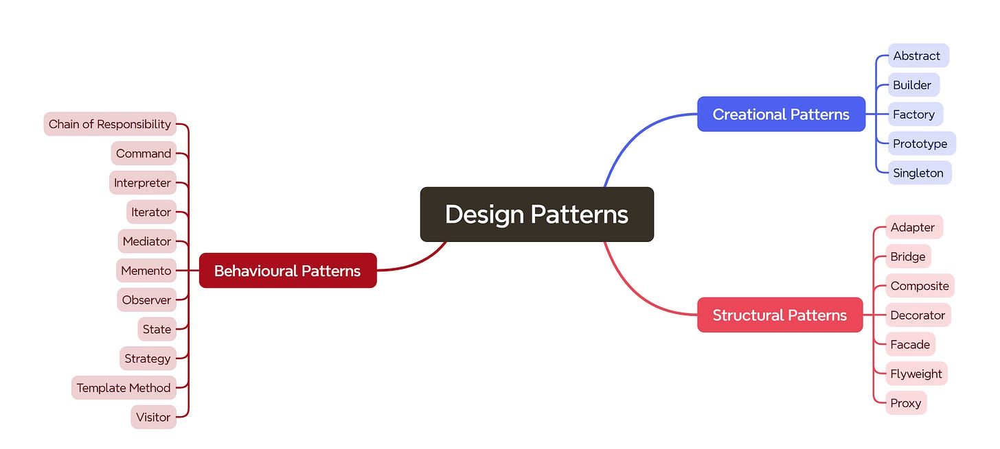

Here's a list of some commonly used design patterns that you can consider implementing to deepen your
understanding of design patterns:

### Creational Patterns:

1. **Singleton Pattern:**
    - Ensures a class has only one instance and provides a global point to that instance.

2. **Factory Method Pattern:**
    - Defines an interface for creating an object but leaves the choice of its type to the subclasses, creating the
      instance.

3. **Abstract Factory Pattern:**
    - Provides an interface for creating families of related or dependent objects without specifying their concrete
      classes.

4. **Builder Pattern:**
    - Separates the construction of a complex object from its representation, allowing the same construction process to
      create different representations.

5. **Prototype Pattern:**
    - Creates new objects by copying an existing object, known as the prototype.

### Structural Patterns:

6. **Adapter Pattern:**
    - Allows the interface of an existing class to be used as another interface.

7. **Decorator Pattern:**
    - Attaches additional responsibilities to an object dynamically. Decorators provide a flexible alternative to
      subclassing for extending functionality.

8. **Proxy Pattern:**
    - Provides a surrogate or placeholder for another object to control access to it.

9. **Composite Pattern:**
    - Composes objects into tree structures to represent part-whole hierarchies. Clients can treat individual objects
      and compositions of objects uniformly.

10. **Flyweight Pattern:**
    - Flyweight is a structural design pattern that allows programs to support vast quantities of objects by keeping
      their memory consumption low.

11. **Bridge Pattern:**
    - The Bridge Pattern is used to separate the abstraction from its implementation so that the two can vary
      independently. This pattern is particularly useful when you want to decouple an abstraction from its
      implementation, allowing them to change and evolve independently.

### Behavioral Patterns:

12. **Observer Pattern:**
    - Defines a one-to-many dependency between objects so that when one object changes state, all its dependents are
      notified and updated automatically.

13. **Strategy Pattern:**
    - Defines a family of algorithms, encapsulates each one, and makes them interchangeable. Strategy lets the algorithm
      vary independently from clients that use it.

14. **Command Pattern:**
    - Encapsulates a request as an object, thereby allowing for parameterization of clients with different requests,
      queuing of requests, and logging of the parameters.

15. **Chain of Responsibility Pattern:**
    - Passes requests along a chain of handlers. Upon receiving a request, each handler decides either to process the
      request or to pass it to the next handler in the chain.

16. **State Pattern:**
    - Allows an object to alter its behavior when its internal state changes. The object will appear to change its
      class.

17. **Visitor Pattern:**
    - Represents an operation to be performed on the elements of an object structure. It lets you define a new operation
      without changing the classes of the elements on which it operates.